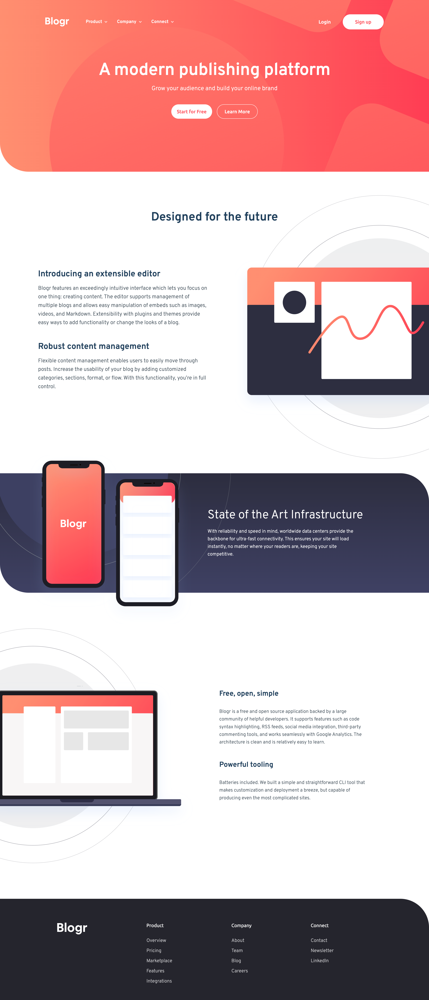

# Frontend Mentor - Blogr landing page solution

This is a solution to the [Blogr landing page challenge on Frontend Mentor](https://www.frontendmentor.io/challenges/blogr-landing-page-EX2RLAApP). Frontend Mentor challenges help you improve your coding skills by building realistic projects. 

## Table of contents

- [Overview](#overview)
  - [The challenge](#the-challenge)
  - [Screenshot](#screenshot)
  - [Links](#links)
- [My process](#my-process)
  - [Built with](#built-with)
  - [Useful resources](#useful-resources)
- [Author](#author)

## Overview

### The challenge

Users should be able to:

- View the optimal layout for the site depending on their device's screen size
- See hover states for all interactive elements on the page

### Screenshot

### Links

- Solution URL: [Solution](https://github.com/danielbrah/blogr-landing-page)
- Live Site URL: [Live Site](https://blogr-landing-page-danielbrah.netlify.app/)

## My process

### Built with

- Semantic HTML5 markup
- CSS custom properties
- SCSS
- Flexbox
- Mobile-first workflow

### Useful resources

- [MDN Docs](https://developer.mozilla.org/en-US/docs/Web) - This helped me with some of the tasks I did not know how to do.

## Author
- Frontend Mentor - [@danielbrah](https://www.frontendmentor.io/profile/danielbrah)
- GitHub - [@danielbrah](https://github.com/danielbrah)